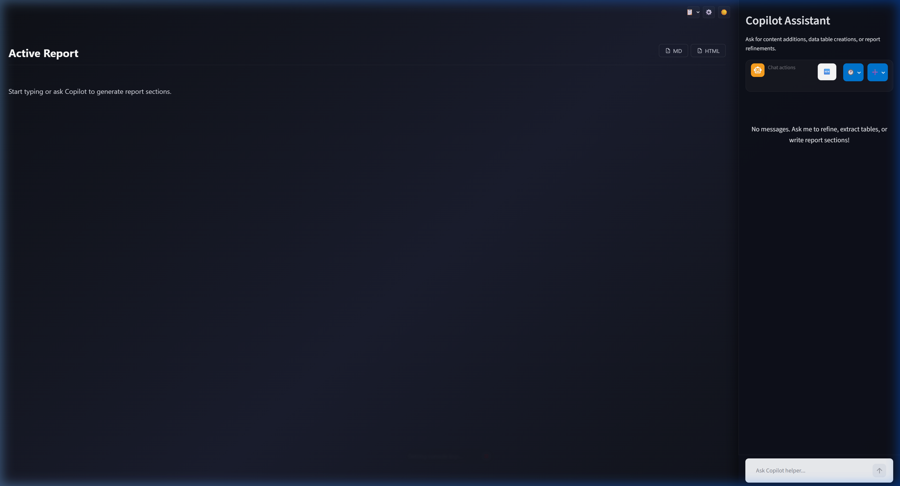

[简体中文](README.md) | [English](README_en.md)

---

# 🧠 Windows 本地智能文档 RAG 系统与报告生成画板

[](https://www.python.org/downloads/)
[](https://streamlit.io/)
[](https://github.com/facebookresearch/faiss)
[](LICENSE)

一个专为 Windows 用户设计的 **免部署、高保真表格重建、向量双阶段检索 (RAG) 报告生成系统**。系统融合了 Markdown 双栏 Canvas 编辑器和 Edge-Copilot 风格的侧边栏 AI 助手，能够安全地在本地提取、检索和分析复杂 PDF 文档数据，并渲染动态 Chart.js 可视化图表。

---

## 📸 界面预览

以下是本系统运行时的核心双栏界面截图（左侧报告画板预览，右侧 AI Copilot 助手与文档引用）：



---

## ✨ 核心特性

- **📁 智能文档导入**：支持多文件夹后台增量同步扫描，支持手动上传单个 PDF。系统将自动提取文本、哈希比对并进行增量切片。
- **📊 智能表格重构**：针对传统 PDF 解析错乱问题，结合 PyMuPDF table 引擎与边界复原算法，保证表格行列属性与标题对齐，避免重要数值和度量标签分离。
- **🔤 向量模型维度自探测**：支持任意 OpenAI 兼容协议的 Embedding 模型。系统会自动发出探测词并探测返回向量维度，无需手动填写即可适配 FAISS。
- **🔍 两阶段检索 (Retrieve & Rerank)**：
  - **初筛召回**：使用 FAISS 内积进行高效余弦相似度检索。
  - **精准重排**：支持集成大模型 Reranker，对召回片段进行 1-10 相关度打分和智能过滤，大大减少环境噪声和非必要上下文。
- **💬 严格防幻觉与引用来源**：自动在对话中添加 inline 引用来源并显示余弦置信度评分，如无真实依据大模型会直白拒绝，彻底避免数据幻觉。
- **🎨 微软 Fluent Design 主题**：原生注入 Fluent 深浅色主题适配，具有玻璃质感（Glassmorphism）与现代卡片光泽效果。
- **🚀 双栏交互画板 (Canvas)**：
  - 左侧为画板，支持 Edit (Markdown 编辑) 与 Preview (高保真 HTML 预览) 双端同步。
  - 画板内置 ` ```chart ` 图表段落解析器，可通过 JSON 自动渲染折线图、柱状图、饼图等 Chart.js 可视化视图。
  - 支持将报告一键下载为 `.md` 格式或包含完整图表脚本的离线 `.html` 文件。
  - 右侧大模型输出能提供针对 Canvas 的自动修改更新，一键应用。

---

## 🚀 快速开始

### 准备环境
- 操作系统：Windows 10 或 Windows 11
- Python 版本：`3.11` 或更高版本
- 网络：初次启动下载依赖需要网络，之后模型接口需要外网（或配置本地大模型接口）。

### 一键启动
1. **获取代码**：克隆或下载此仓库至本地文件夹（路径中尽量避免中文）。
2. **启动系统**：在根目录下找到 `windows-rag-system/run.cmd`，**双击运行**。
   - 脚本会自动检测 Python。
   - 自动在本地创建虚拟环境 `venv`。
   - 自动安装依赖包并补全 `data/` 目录结构。
   - 自动拉起 Streamlit 并打开浏览器页面。
3. **访问系统**：在浏览器中打开 `http://localhost:8501`。

---

## ⚙️ 全程使用教程 (GitHub 部署版)

### 步骤一：配置 API 密钥与模型

1. 点击主界面右上角或侧边栏顶部的 **⚙️ Settings (系统设置)**。
2. 在弹出面板中选择 **🔑 API & Model Settings**。
3. 切换至 **🛠️ API Providers** 面板中，添加您的 LLM & Embedding 服务提供商（如星火、火山、DeepSeek、OpenAI 等），配置接口的 `Base URL` 和 `API Key`，并填写模型列表。
4. 切换至 **💬 Chat Models** 或 **🔤 Embeddings** 选项卡，指定默认的对话模型与向量模型，调整 Chunker 大小（建议 `chunk_size` 保持在 800 左右），点击 **Save**。

> [!TIP]
> 接口密钥等敏感信息将安全保存在本地的 `config/api_keys.local.json` 中，绝不会上传至外部网络。

### 步骤二：同步与索引 PDF 文档

1. 在 **⚙️ Settings** 中，切换至 **📁 Document Settings**。
2. 在 `Folder Path` 输入框中填入本地 PDF 文件存储目录（例如本仓库中包含的 `C:/Users/Ivan/Desktop/Report QA1/1. Report`）。
3. 点击 **Add** 按钮。
4. 点击 **↺ Sync** 或是 **Re-index**，系统将在后台启动多线程任务读取文件、切片并创建 FAISS 向量索引。
5. 任务完成后，界面上方会提示同步或索引文件数量。

### 步骤三：编写报告与 AI Copilot 侧边栏对话

1. **左侧画板操作**：
   - 点击 **Save/Load** 按钮从历史保存的报告列表中载入报告，或直接在文本区中修改标题与 Markdown 文本。
   - 切换到 **Preview** Tab 即可欣赏高保真 Fluent 设计排版及图表。
2. **右侧 Copilot 助手操作**：
   - 遇到任何需要数据支撑的结论，在右侧输入框向 AI 提问（例如：“总结今年四季度主机的能效趋势，并用折线图表达”）。
   - Copilot 检索召回您的 PDF 文档，回答后将提供对应的文件出处。
   - 如果 AI 的回答中包含对报告的改进建议，AI 会生成 `markdown-canvas` 容器。点击 AI 回答上方的 **"Apply to Canvas (应用修改到画板)"** 按钮，即可将改动一键同步到左侧编辑器。
3. **导出报告**：
   - 在左侧预览页面的右上角，悬浮了 `MD` 和 `HTML` 导出按钮。
   - 点击 `MD` 导出原始排版文档；点击 `HTML` 即可导出一份自带 Chart.js 脚本的单文件网页，双击即可在任何离线电脑上进行无损汇报展示！

---

## 📁 目录结构树

```
windows-rag-system/
├── app.py                    # Streamlit Entry (入口路由与初始化)
├── run.cmd                   # Windows 双击一键启动脚本
├── requirements.txt          # Python 包版本声明
├── config/
│   ├── settings.json         # 向量块大小与重排等设定
│   └── api_keys.json         # 服务商预设配置模板
├── core/
│   ├── api_persistence.py    # 本地 API 密钥持久化逻辑
│   ├── pdf_loader.py         # PyMuPDF 智能提取段落与表格
│   ├── chunker.py            # 段落与表格隔离切片器
│   ├── embedder.py           # 向量转换与维度自动探针
│   ├── retriever.py          # 向量库相似度匹配
│   ├── reranker.py           # LLM 对切块进行两阶段精排序
│   ├── rag_pipeline.py       # RAG 执行流程统筹
│   ├── data_extractor.py     # 基于正则的指标与日期拾取
│   └── report_generator.py   # 生成报告与 Markdown 段落归类
├── ui/
│   ├── theme.py              # 流畅设计 CSS 注入适配深浅色
│   ├── api_settings.py       # 浮动设置面板 (包含文档与API配置)
│   └── report_generator.py   # 双栏画板与 Copilot 助手面板
└── utils/
    ├── paths.py              # 相对物理路径自适应定位
    ├── file_io.py            # 安全的原子级文件存取
    ├── logger.py             # 运行日志记录
    └── background_task.py    # Streamlit 后台多线程工具
```

---

## 🔧 常见问题与排除故障

#### 1. 为什么后台同步或 Re-index 提示失败？
- 可能是当前 Embedding API 的密钥无效、模型名称填写错误、或者本地网络无法连接该模型端点。
- 请检查 **⚙️ Settings** 中对应提供商的状态指示灯，确保显示为 **🟢 Active**。如果由于切换模型导致原有 FAISS 维度和新模型不一致，请点击 **Clear Index** 清除历史索引，然后再点击 **Re-index**。

#### 2. 大模型返回了空白或者报错 "API Not Configured"
- 请确保您在 API Settings 中设置了默认的提供商和模型，并且点击了 **Save** 保存按钮，状态为已就绪。

#### 3. 页面渲染图表报错 "Chart render error"
- 请确保您在 ` ```chart ` 标签中编写的 JSON 格式是严格规范的（即所有的键和字符串都必须使用**双引号**，且不存在尾部逗号）。
- 示例格式：`{ "type": "bar", "title": "能耗", "labels": ["A", "B"], "datasets": [{ "label": "量级", "data": [10, 20] }] }`

---

## 🛡️ 隐私与安全性声明

- **本地保存**：本系统所解析的所有 PDF 原始文本、FAISS 向量以及 Canvas 报告历史均**永久保存在本地电脑**中，不经过任何外部服务器中转。
- **API 通信**：仅在生成向量嵌入和调用大语言模型进行问答对话时，会将特定文本片段（Context）通过 HTTPS 加密传输至您配置的 API 提供商端点。
- **免密运行**：本地 mock 服务器模式无需配置任何密匙即可测试基础流。

---

## 📝 许可证

本项目基于 **MIT License** 协议开源，允许个人或企业进行商业修改和二次分发。
