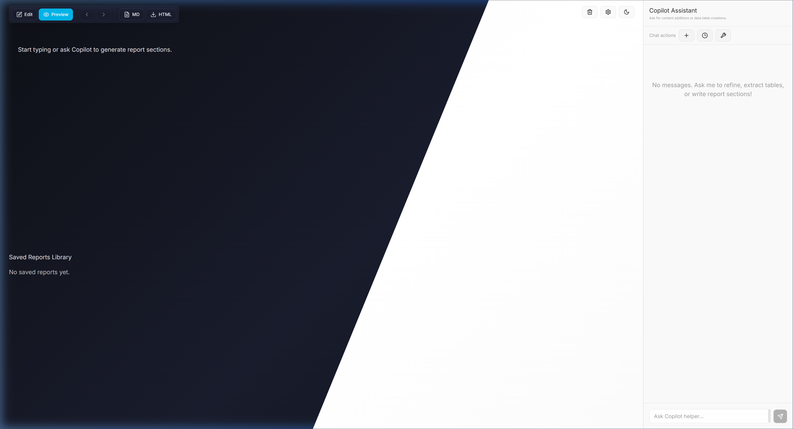
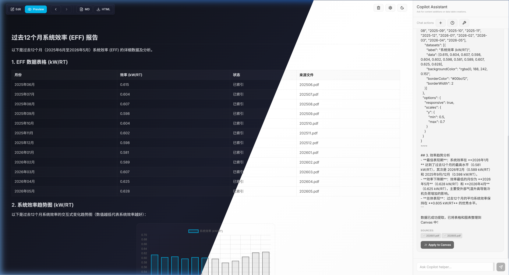
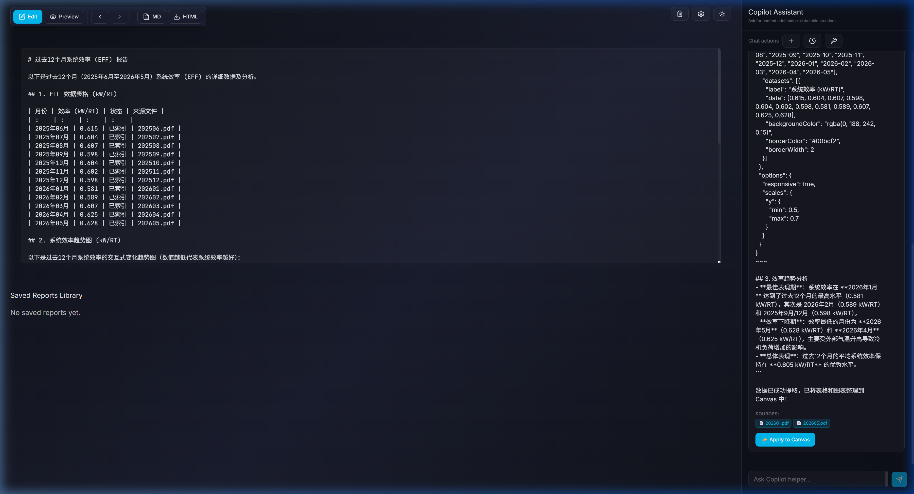
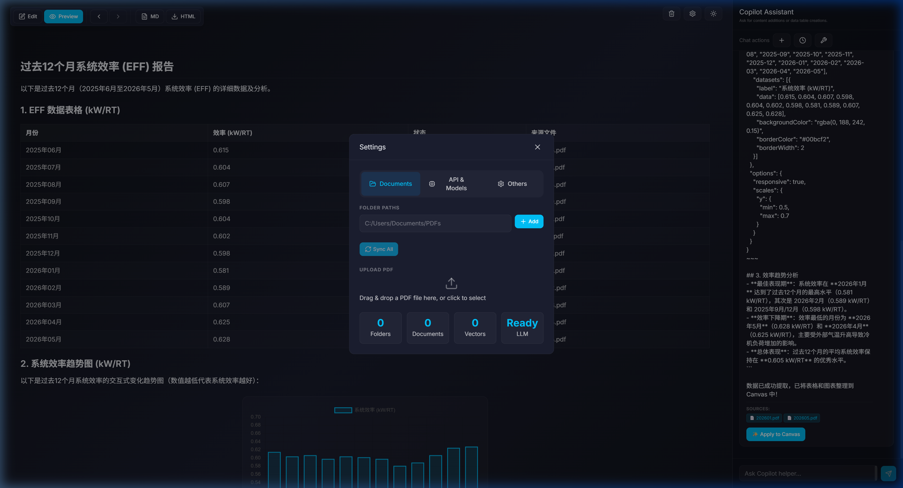

# Report QA (Windows 本地智能文档 RAG 系统与报告生成画板)

[English](README.md) | **简体中文**

[](https://www.python.org/)
[](https://tauri.app/)
[](https://github.com/facebookresearch/faiss)
[](LICENSE)

一款专为 Windows 用户设计的 **免部署、高保真表格重建、向量双阶段检索 (RAG) 报告生成系统**。系统融合了 Markdown 双栏 Canvas 编辑器和 Edge-Copilot 风格的侧边栏 AI 助手，能够安全地在本地提取、检索和分析复杂 PDF 文档数据，并渲染动态 Chart.js 可视化图表。

本工具采用了微软 Fluent Design 现代暗色主题与 Mica 半透明磨砂玻璃材质，并配备了动态数据预览表格和实时系统日志面板，方便用户跟踪数据流水线的处理进度。

---

## 🎬 演示视频 (Demo)


---

## 📸 软件界面与运行截图

### 1. 软件初始主界面
简洁美观的微软 Fluent Design 界面，左侧为画板展示区域，右侧为 Copilot AI 侧边助手，支持侧边栏宽度自由拖拽改变大小：


### 2. AI Copilot 问答与 Canvas 自动重构
当向 Copilot 提问（如“找出过去12个月的eff数据”）时，系统自动执行 RAG 检索并给出精确的文档来源引用。若 AI 的回答中包含对报告的改进建议，Canvas 画板会动态渲染出完整的 **12个月能效数据表格** 和交互式 **Chart.js 趋势图表**：


### 3. Markdown 编辑与双端同步
点击画板左上角浮动工具栏的 **Edit** 按钮，即可切换至 Markdown 源码编辑模式，支持编写标准 Markdown 文本与 `~~~chart-config` 格式的图表配置：


### 4. 居中设置面板与 API 配置
点击右上角的 **Gear (设置)** 按钮，可唤出全局屏幕居中对齐的设置弹窗。支持在 `Documents` 选项卡添加监控文件夹，在 `API & Models` 选项卡中动态添加、修改 providers 和 API 密钥（敏感信息全部安全存储于本地）：


---

## 🚀 核心功能特性

Report QA 提供了一个完整的 RAG 问答与文档报告编写流水线：

1. **📁 智能文档导入与监控**
   - 支持多文件夹后台增量同步扫描，支持手动上传单个 PDF。
   - 系统会自动提取文本、进行 MD5 哈希比对并进行智能切片。

2. **📊 智能表格重构**
   - 针对传统 PDF 解析错乱问题，结合 PyMuPDF table 引擎与边界复原算法。
   - 保证表格行列属性与标题对齐，避免重要数值和度量标签分离，重构出完美的 HTML/Markdown 数据表。

3. **🔤 向量模型维度自探测**
   - 支持任意 OpenAI 兼容协议 of Embedding 模型。
   - 系统会自动发出探测词并探测返回向量维度，无需手动配置即可完美适配本地 FAISS 向量库。

4. **🔍 双阶段检索 (Retrieve & Rerank)**
   - **初筛召回**：使用 FAISS 内积进行高效的余弦相似度检索，秒级提取相关知识切块。
   - **精准重排**：集成大模型 Reranker，对召回片段进行相关度打分与智能过滤，大大减少上下文冗余与非必要噪声。

5. **💬 严格防幻觉与引用来源**
   - 自动在对话中添加 inline 引用来源并显示置信度评分，点击出处可追溯。
   - 遵循严格的防御策略，如无真实依据大模型会直白拒绝，彻底避免数据幻觉。

6. **🚀 交互式双栏画板 (Canvas)**
   - 支持 **Edit** (Markdown 编辑) 与 **Preview** (高保真预览) 双端同步。
   - 内置图表段落解析器，可通过简单的 JSON 配置渲染出柱状图、折线图等交互式 Chart.js 可视化图表。
   - 支持一键将报告下载为 `.md` 格式，或包含完整图表离线渲染脚本的单文件 `.html`。

---

## 🛠️ 以 12个月 EFF 能效报告 为例的演练步骤

您可以导入包含时序能效 PDF 报告的文件夹进行测试：

1. **导入与索引文件**：
   - 打开右上角 **⚙️ Settings** -> **📁 Document Settings**。
   - 输入包含月度 PDF 报告的文件夹绝对路径，点击 **Add** 并点击 **Re-index** 进行多线程索引构建。
2. **AI Copilot 提问**：
   - 索引构建完成后，在右侧侧边栏输入：“找出过去12个月的eff数据，并生成合适的图表”并发送。
   - Copilot 会检索本地文档，回答中自动包含各月份能效数据，并标注数据来源于哪个 PDF 报告。
3. **一键应用到画板**：
   - 点击 Copilot 回答上方的 **Apply to Canvas** 按钮，左侧画板会瞬间自动排版，重构出精美的能效数据表格和柱状趋势图。
4. **编辑与预览**：
   - 点击画板顶部的 **Edit** 微调报告文字，或在 `~~~chart-config` 块中修改图表的颜色、跨度或标题。
   - 切换到 **Preview** Tab，查看渲染后的高保真交互图表。
5. **离线报告导出**：
   - 点击悬浮工具栏的 **HTML** 按钮，系统会自动导出单文件 HTML 并保存到您的系统下载文件夹。
   - 导出的网页完全离线可用，包含全部排版与 Chart.js 脚本，可在任何设备上双击进行无损汇报展示。

---

## 🖥️ 本地运行与构建

### 开发环境准备
* 安装 **Node.js** v18+ (推荐 LTS 版本)
* 安装 **Python** 3.11+
* 安装 **Rust** 工具链（如需编译 Tauri 桌面客户端）

### 安装依赖

#### 1. 后端 Python 依赖
进入 `windows-rag-system` 目录并运行 `run.cmd`，系统将自动创建虚拟环境并安装所需依赖包：
```cmd
cd windows-rag-system
./run.cmd
```
或者手动通过 pip 安装：
```bash
pip install -r requirements.txt
```

#### 2. 前端 Node.js 依赖
进入 `tauri-ui` 目录并安装：
```bash
cd tauri-ui
npm install
```

### 启动开发服务器

#### 1. 启动 Python 后端
在 `windows-rag-system` 目录下执行启动命令：
```bash
python query_rag.py "测试查询"
```

#### 2. 启动前端与 Tauri 客户端
在 `tauri-ui` 目录下，启动带热重载的 Tauri 桌面应用程序开发模式：
```bash
npm run tauri dev
```
如果只需在普通浏览器中预览运行：
```bash
npm run dev
```
然后打开浏览器访问 [http://localhost:5173](http://localhost:5173)。

### 编译打包
如需打包为 Windows 独立的 `.exe` 原生安装程序：
```bash
npm run tauri build
```
打包输出的安装程序将会保存在 `src-tauri/target/release/bundle/nsis/` 目录下。

---

## 📁 项目目录结构

```
Report QA/
├── tauri-ui/                   # Tauri 前端应用 (React + TS + Vite)
│   ├── src/                    # 前端 React 源代码
│   │   ├── components/         # 画板、侧边栏及设置组件
│   │   ├── stores/             # Zustand 全局状态管理
│   │   ├── styles/             # Fluent 设计主题与 Mica 玻璃效果
│   │   └── main.tsx            # 前端应用入口 (带网页 Mock 桥)
│   ├── src-tauri/              # Tauri Rust 后端
│   │   ├── src/lib.rs          # 核心系统命令（扫描文件、保存 API、RAG 执行）
│   │   └── tauri.conf.json     # Tauri 配置文件
│   └── package.json            # npm 脚本与依赖项
└── windows-rag-system/         # Python RAG 核心服务
    ├── config/                 # 设定文件 (settings.json, api_keys.json)
    ├── core/                   # RAG 检索流水线、分块器及重排核心
    ├── llm/                    # 多服务商大模型调用网关
    ├── utils/                  # 路径自适应、文件 IO 及日志模块
    ├── query_rag.py            # RAG 问答命令行接口
    ├── sync_index.py           # 扫描目录与向量索引增量构建脚本
    └── requirements.txt        # Python 依赖依赖项声明
```

---

## 🔧 常见问题与故障排除

#### 1. 为什么后台 Sync 或 Re-index 提示失败？
- 请检查 **⚙️ Settings** 中对应提供商的状态指示灯，确保显示为 **🟢 Active**。
- 如果由于切换模型导致原有 FAISS 维度和新模型不一致，请点击 **Clear Index** 清除历史索引，然后再点击 **Re-index** 重构。

#### 2. 大模型返回了空白或者报错 "API Not Configured"
- 请确保您在 Settings 的 API & Models 中配置了可用的提供商和 API 密钥，且在对应选项卡中指定了默认的对话模型与向量模型，并点击了 **Save**。

#### 3. 页面渲染图表报错 "Chart render error"
- 请确保您在 ` ```chart ` 或 `~~~chart-config` 块中编写的 JSON 格式是严格规范 of （所有的键和字符串都必须使用双引号 `"`，且不存在多余的尾部逗号）。

---

## 🛡️ 隐私与安全性声明

- **本地保存**：本系统所解析的所有 PDF 原始文本、FAISS 向量以及 Canvas 报告历史均**永久保存在本地电脑**中，不经过任何外部服务器中转。
- **API 通信**：仅在生成向量嵌入和调用大语言模型进行问答对话时，会将特定文本片段（Context）通过 HTTPS 加密传输至您配置 of API 提供商端点。
- **免密运行**：本地 mock 浏览器测试模式无需配置任何密钥即可进行前端功能测试。

---

## License
本项目采用 MIT 许可协议开源 - 详情请参阅 [LICENSE](LICENSE) 文件。

## Contributing
欢迎提交贡献！请随时提交 Pull Request。
提交 Pull Request 即表示您同意在相同的 [MIT 许可协议](LICENSE) 下授权您的贡献。

---

## 支持与赞助 (Buy Me a Coffee)

如果您觉得 Report QA 帮您节省了时间、解决了数据检索和报告重构难题，欢迎请开发者喝杯咖啡，支持持续的开发和维护！☕


